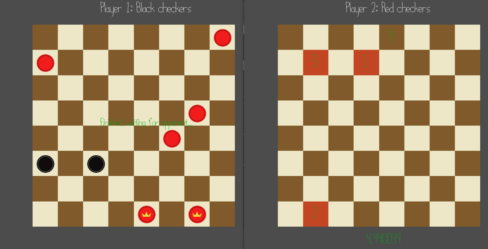

# Speed Checkers

Author: Kyle Jannak-Huang

Design: This is a classic game of checkers, but with a twist. That twist is that every 4 moves each, there is a speed challenge, in which the players must click the randomized
boxes as quickly as possible. The player whose turn it is has one less square to click; the other player has the chance to steal the turn.

Networking: The client and server both send messages of constant sizes for simplicity, but depending on the state of the game some of the bytes represent different variables.

The client receives messages in update() on line 274 of PlayMode.cpp, and sends messages in send_data() on line 353 of PlayMode.cpp. 
The client's messages are 68 bytes long, and sent every time the player causes a change to the game state.

The first byte is the message type, which ensures the integrity of the messages.

The second byte is the current game mode. This is actually tracked on the server side, but the client sends what game mode it is in when the message is sent to avoid bugs when transitioning between game modes.

The third byte is the player id. This makes it easier on the server side to keep track of which message is from which player.

The fourth byte depends on the game mode. In the waiting screen, it indicates whether the player is ready, and in game, it indicates if pieces were taken.

The remaining 64 bytes are the state of each square on the checkerboard. The true state of the checkerboard is tracked on server-side, but the changes made by the player are transmitted and then propagated to all players.

The server receives messages on line 126 of server.cpp, and sends messages on line 244 of server.cpp. The messages are 70 bytes long, and sent once per server tick.

The first byte is the message type.

The second byte is the player id, which the player verifies in addition to the message type to make sure it received the correct message.

The third byte is the game mode, the fourth byte is whose turn it is, the fifth and sixth bytes are the respective scores of each player.

The remaining 64 bytes depend on the game mode. It is the true state of the checkerboard when in game, and it is the board containing the randomized squares during the speed challenge. 
The squares are the same for each player.

Screen Shot:

How To Play:

Controls: 

During the ready-up screen:

Press spacebar to toggle readiness.

During checkers:

Click on squares with your mouse to select moves. Press spacebar to input the move. If the move is illegal, it will clear your selected moves. 
You can also press c to clear your selections.

An example move would be to click on a square with your piece, then move diagonally one square. 
Another example would be to click on a square with your piece, then hop over any number of pieces diagonally.

Selected squares will not duplicate, so you don't have to worry about clicking the same square twice.

During the speed challenge:

Click on the squares in the indicated order with your mouse.

Game Rules:

Standard checkers rules apply. There will be a 5 second countdown before each speed challenge. 

The player who just moved will have to click 5 squares in order, whereas the player who is supposed to move next will only have to click 4.

It could be beneficial to not steal a turn. If this is the case, you can run out the 30 second speed challenge timer, and ensure that the game will continue as normal.

This game also supports more players connecting as spectators, but if one of the original two players leaves, it will be impossible to continue the game.

Sources: I created all the assets myself using GIMP. In server.cpp, I used some code from https://en.cppreference.com/w/cpp/algorithm/random_shuffle to randomize the squares for the speed challenge.

Note: When the size of the chess board is calculated, it assumes that your window is wider than it is long. If you try to make it very narrow it will clip off screen.

This game was built with [NEST](NEST.md)..

